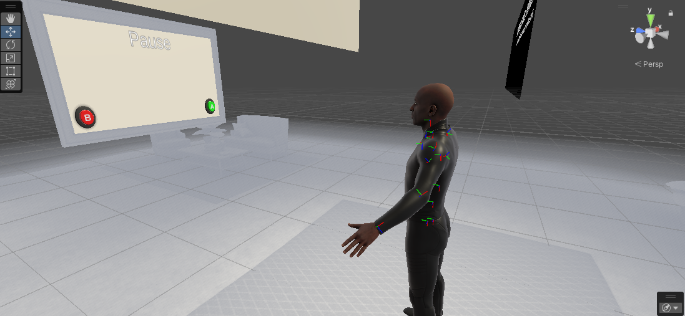

# UnitySoftbotsTeleopRelease

Repository for the Unity-based SoftBots teleoperation system release.

<p align="center">
  
</p>

## Description

UnitySoftbotsTeleopRelease is a framework developed by the Italian Institute of Technology (IIT) that enables teleoperation of soft robots (SoftBots) using the Unity environment. This project provides an intuitive interface for remotely controlling soft robots through various input devices across a network.

The system leverages Meta's Movement SDK to automatically calibrate by calculating the operator's body dimensions, enabling precise control mapping between the human operator and the robot. Hand tracking can also be activated for enhanced manipulation capabilities.

## Key Features

- Integration with Unity for real-time 3D visualization
- Automatic operator body calibration using Meta's Movement SDK
- Optional hand tracking for precise manipulation
- Compatible with both ROS1 and ROS2 frameworks
- Network-based control for remote operation
- Auto-discovery of robots on the network via broadcast messages
- Customizable user interface for SoftBots control
- Support for soft robot simulation
- Bidirectional communication between the control interface and physical robots

## System Requirements

- Unity 2020.3 LTS or higher
- Windows 10/11 or macOS 10.15+ or Linux (Ubuntu 20.04 recommended)
- .NET Framework 4.x
- Supported input devices (e.g., joystick, haptic devices, VR controllers)
- Network connectivity between the control station and robot

## Installation

1. Clone this repository:
   ```
   git clone https://github.com/IIT-SoftBots/UnitySoftbotsTeleopRelease.git
   ```

2. Open the project with Unity Hub by selecting the cloned folder

3. Make sure you have all required packages installed (check in Unity Package Manager)

4. Install the Python broadcast script on the robot's computer

## Basic Usage

1. Open the main scene in `Assets/Scenes/MainTeleop.unity`
2. Start the Python broadcast script on the robot's computer to announce its presence on the network
3. In Unity, navigate to `Robotics -> ROS Settings` and select either ROS1 or ROS2 based on your robot setup
4. The system will automatically discover the robot on the network using the broadcast listener
5. Start the scene and use the teleoperation interface to control the robot

## Network Configuration

The system uses a network discovery mechanism:
1. The Python script on the robot broadcasts messages containing the robot's IP address and name
2. The Unity application listens for these broadcast messages
3. When a robot is discovered, it appears in the available robots list in the interface
4. Select the robot you wish to control to establish the connection

## Advanced Configuration

### Customizing the Interface

The user interface can be customized by modifying the UI elements in the scene. You can access the UI components through the object hierarchy in Unity.

### Operator Calibration

The system automatically calibrates to the operator's body dimensions using Meta's Movement SDK:
1. Stand in a T-pose when prompted
2. The system will calculate your body dimensions
3. The teleoperation mapping will be adjusted accordingly for your proportions

### Adding New Robots

To add a new robot model:
1. Import the 3D model into the `Assets/Models` folder
2. Create a new prefab in the `Assets/Prefabs/Robots` folder
3. Assign the `SoftBotController` component to the prefab
4. Configure the robot-specific parameters in the component

## System Architecture

The system is structured into several main modules:

- **Core**: Contains the base functionality of the framework
- **Teleop**: Manages the communication between the user interface and the robot
- **Network**: Handles robot discovery and communication protocols
- **Calibration**: Manages automatic operator body calibration
- **Simulation**: Provides tools for simulating soft robot behavior
- **UI**: Implements the user interface for teleoperation control

## ROS Integration

The system works with both ROS1 and ROS2:
1. Navigate to `Robotics -> ROS Settings` in the Unity menu
2. Select the appropriate ROS version (ROS1 or ROS2)
3. Configure any specific ROS parameters needed
4. The system will automatically adapt the communication protocols accordingly

## Troubleshooting

### Connection Issues
- Verify that the robot is powered on and connected to the network
- Check that the Python broadcast script is running on the robot's computer
- Ensure both the control station and robot are on the same network
- Check firewall settings to allow broadcast messages
- Verify the connection parameters in the Inspector panel

### Calibration Issues
- Ensure you are fully visible to the tracking system
- Maintain a clear T-pose during calibration
- Check that the Movement SDK is properly initialized
- Try recalibrating if the proportions seem incorrect

### Performance Issues
- Reduce the graphics quality in Unity settings
- Decrease the teleoperation data update frequency
- Close other applications that might consume system resources

## License

This project is distributed under the [specify license, e.g., MIT, Apache 2.0, etc.]


## Developers

This project was developed by the Italian Institute of Technology (IIT), SoftBots research group.
<!-- CONTRIBUTORS -->
<h2 id="contributors"> Contributors</h2>
<p>
  :man: <b>Giovanni Rosato</b> <br>
  &nbsp;&nbsp;&nbsp;&nbsp;&nbsp; Email: <a>giovanni.rosato@iit.it</a> <br>
  &nbsp;&nbsp;&nbsp;&nbsp;&nbsp; GitHub: <a href="https://github.com/GianniRos">@GianniRos</a> <br>
  &nbsp;&nbsp;&nbsp;&nbsp;&nbsp; Linkedin: <a href="https://www.linkedin.com/in/giovanni-rosato-6284bb161/">@giovanni-rosato-linkedin</a> <br>
</p>